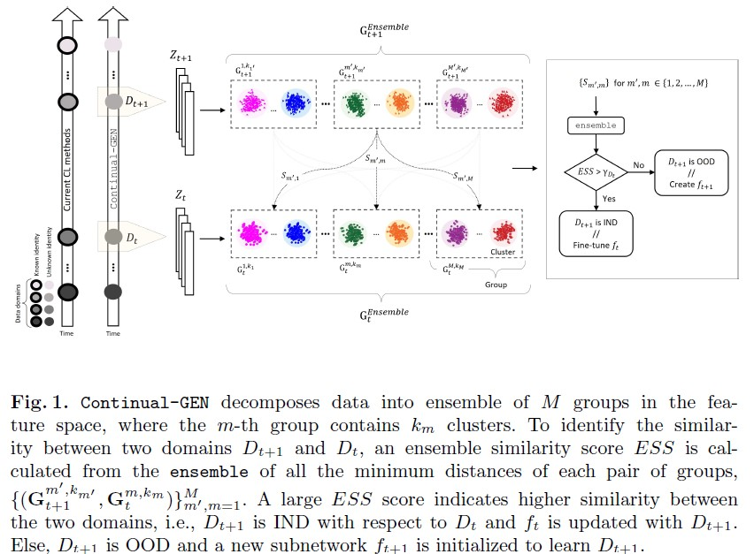

# Continual-GEN
This is the PyTorch implementation of paper (**Continual-GEN: Continual Group Ensembling for Domain-agnostic Skin Lesion Classification**), accepted at the ISIC workshop @ MICCAI 2023.

## Abstract
Designing deep learning (DL) models that adapt to new data without forgetting previously acquired knowledge is important in the medical field where data is generated daily, posing a challenge for model adaptation and knowledge retention. Continual learning (CL) enables models to learn continuously without forgetting, typically on a sequence of domains with known domain identities (e.g. source of data). In this work, we address a more challenging and practical CL scenario where
information about the domain identity during training and inference is unavailable. We propose Continual-GEN, a novel forget-free, replay-free, and domain-agnostic subnetwork-based CL method for medical imaging with a focus on skin lesion classification. Continual-GEN proposes an ensemble of groups approach that decomposes the training data for each domain into groups of semantically similar clusters. Given two domains, Continual-GEN assesses the similarity between them based on the distance between their ensembles and assigns a separate subnetwork if the similarity score is low, otherwise updating the same subnetwork to learn both domains. At inference, Continual-GEN selects the best subnetwork using a distance-based metric for each test data, which is directly used for classification. Our quantitative experiments on four skin lesion datasets demonstrate the superiority of Continual-GEN over state-of-the-art CL methods, highlighting its potential for practical applications in medical imaging.

<p align="center">
  
</p>

## File Description
- baseline_training: Training algorithm of the cross-entropy baseline model.
- constrastive_training: Includes both SupCon and SimCLR trainings, the desired one can be selected by changing --method argument.
- contrastive_test: Evaluation of the contrastive models, calculating their global separation by class and k-means clusters.
- losses: Defines the constrastive loss function.
- util: Contains functions used throughout the project.
- prompts: Command promts to execute each training file. The examples inside are those used to train the final models.

## Requirements
All the necessary libraries are listed in the requirements.txt file. You will also need:
- Python == 3.10
- CUDA == 11.7
- Cudnn == 8.5
- Pytorch == 2.0.0

## Training and Evaluation
Here you can find the command prompts used to run each training method. You can edit the hyperparameters here or inside the corresponding code file.

- Cross-Entropy baseline: `python baseline_training.py --batch_size 16 --learning_rate 0.001 --epochs 150 --trial 2`
- SupCon: `python contrastive_training.py --batch_size 16 --learning_rate 0.001 --epochs 150 --temp 0.1 --trial 0`
- SimCLR: `python contrastive_training.py --batch_size 16 --learning_rate 0.001 --epochs 150 --method SimCLR --temp 0.1 --trial 0`

Testing contrastive models
- `python contrastive_test.py --method CE`
- `python contrastive_test.py --method SupCon`
- `python contrastive_test.py --method SimCLR`
  
#In method you choose between SimCLR or SupCon

## References
https://github.com/HobbitLong/SupContrast

## Citation
If you use this code in your research, please consider citing:
```bash
@inproceedings{bayasi2023continual-gen,
title={{Continual-GEN}: Continual Group Ensembling for Domain-agnostic Skin Lesion Classification},
author={Bayasi, Nourhan and Du, Siyi and Hamarneh, Ghassan and Garbi, Rafeef},
booktitle={26th International Conference on Medical Image Computing and Computer Assisted Intervention (MICCAI 2023) ISIC Workshop}}


